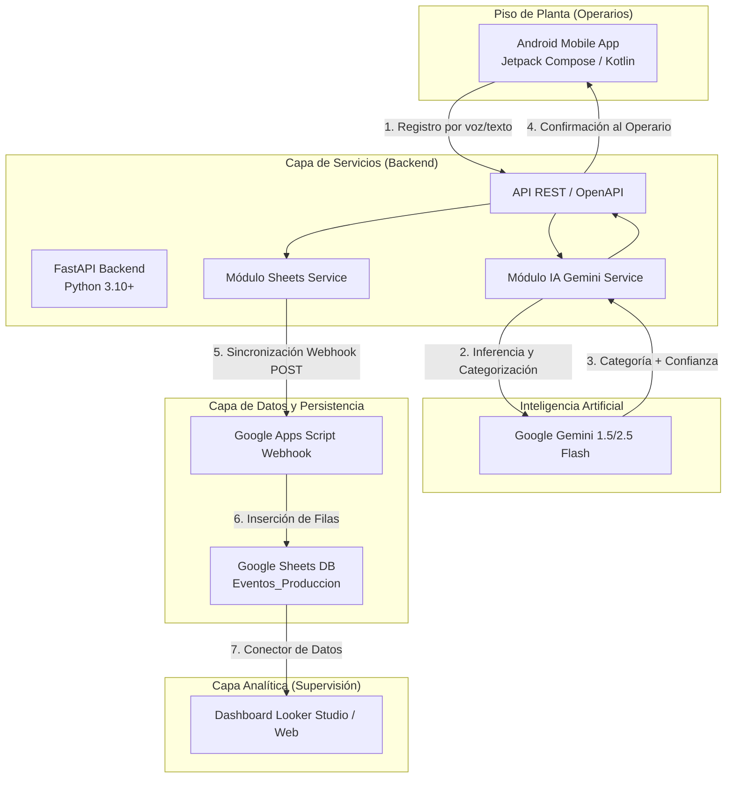

# Arquitectura del Sistema - SuperBrix IA

Este documento describe la arquitectura global, topología de componentes y protocolos de comunicación de la plataforma **SuperBrix IA**.

---

## 1. Topología General de Componentes

SuperBrix IA está diseñado como un ecosistema modular orientado a manufactura industrial:

---

## 2. Descripción de Capas

### 2.1. Aplicación Móvil Android (`android/`)
- **Tecnologías**: Kotlin, Jetpack Compose, Coroutines, StateFlow, Material Design 3.
- **Responsabilidad**:
  - Capturar interrupciones y eventos de producción directamente en la estación de trabajo.
  - Proveer interfaz rápida y accesible para operarios (modo oscuro/claro, botones táctiles grandes para ambiente industrial).
  - Feedback visual inmediato del análisis de IA (pantalla de confirmación con porcentaje de confianza y categoría).

### 2.2. Backend API (`backend/`)
- **Tecnologías**: Python 3.10+, FastAPI, Pydantic v2, Uvicorn, HTTPX.
- **Responsabilidad**:
  - Orquestar la clasificación con modelos generativos (Gemini).
  - Ofrecer resiliencia mediante clasificador heurístico de reglas cuando no hay conexión a internet o cuota de API.
  - Persistir registros en memoria local y sincronizar asíncronamente con Google Sheets.

### 2.3. Motor de Inferencia IA
- **Modelo**: Gemini Flash (Google AI).
- **Entrada**: Descripción libre en lenguaje coloquial (ej. *"se partió la fresa de 10mm por vibración"*).
- **Salida**: Asignación estandarizada a una de las 6 categorías industriales, confianza (`%`), explicación técnica y recomendación de acción.

### 2.4. Google Sheets & Apps Script (`google/`)
- **Tecnologías**: Google Apps Script (JavaScript V8), Google Sheets API.
- **Responsabilidad**:
  - Base de datos relacional ligera, accesible y editable por el personal de ingeniería sin requerir infraestructura de servidor adicional.
  - Formateo condicional dinámico según el tipo y criticidad de la parada.

### 2.5. Dashboard y Visualización (`dashboard/`)
- **Tecnologías**: Google Looker Studio.
- **Responsabilidad**:
  - Métricas de OEE (Efectividad Total de los Equipos).
  - Gráficos de Pareto de paradas por máquina y por causa raíz.
  - Indicadores clave para juntas diarias de producción (Daily Standups).
