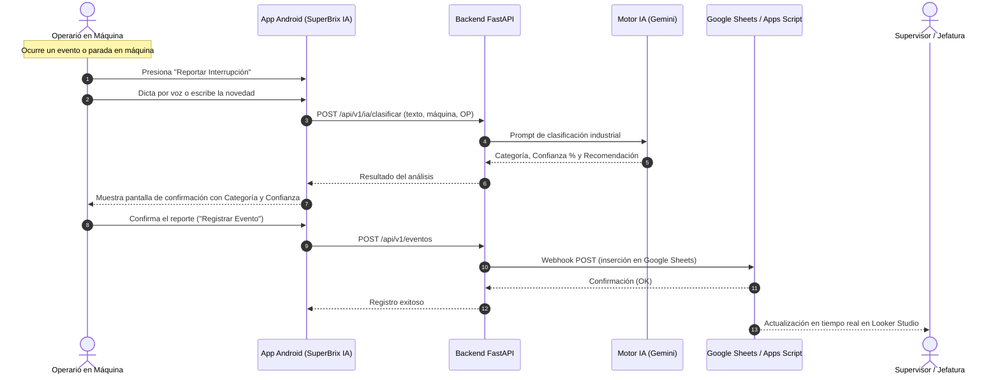

# Flujo Operativo en Planta - SuperBrix IA

Este documento describe el paso a paso del flujo de trabajo operativo entre el operario en el puesto de mecanizado, el sistema móvil, el backend de IA y el equipo de supervisión.

---

## Diagrama de Secuencia Operativa

---

## Etapas del Proceso

### 1. Detección y Notificación en Máquina
* El operario (ej. Sara en Fresadora 01) detiene el ciclo de mecanizado por una causa ajena o técnica.
* Abre la aplicación **SuperBrix IA** instalada en la tableta o smartphone del puesto de trabajo.

### 2. Captura del Evento
* La pantalla principal muestra la máquina y la Orden de Producción actual (`OP-001`).
* El operario pulsa el botón de interrupción y describe la situación con lenguaje natural habitual:
  > *"Paré la fresadora porque estoy esperando la broca de 1/2 pulgada."*

### 3. Análisis en Tiempo Real por Inteligencia Artificial
* El motor de IA analiza semánticamente el mensaje.
* Determina la categoría más acertada (`Espera de Materiales / Logística`) con un nivel de confianza (`95%`).
* Sugiere una acción preventiva/correctiva para planta.

### 4. Aprobación y Registro
* La app muestra la tarjeta de resultado visual:
  - **Categoría asignada con código de color**.
  - **Porcentaje de certeza**.
  - **Tiempo transcurrido estimado**.
* El operario valida y presiona **Confirmar**.

### 5. Sincronización y Acción de Planta
* El evento queda registrado en la hoja central `Eventos_Produccion`.
* Los supervisores observan el evento en el tablero de control, lo que permite despachar la broca requerida sin demoras innecesarias por traslados a pie.
* Al reanudar la labor, el operario pulsa **"Reanudar Labor"**, cerrando el ciclo de tiempo muerto.
